
<i>Feature Extraction via Random Recurrent Deep Ensembles and its Application in Group-level Happiness Estimation</i>

## Table of Contents
1. [Abstract](#1-abstract)
2. [Introduciton](#2-introduction)
	* [2.1 Motivation](#21-motivation)
	* [2.2 Description of Proposed Approach](#22-description-of-proposed-approach)  
	* [2.3 Database: HAPPEI](#23-database-happei)
3. [Background Knowledge](#3-background-knowledge)
	* [3.1 Feed-forward Neural Network](#31-feed-forward-neural-network)
	* [3.2 Convolutional Neural Network](#32-convolutional-neural-network)
	* [3.3 Recurrent Neural Network: Long-Short Term Memory](#33-recurrent-neural-network-long-short-term-memory)
4. [Our Approach and Methodology](#4-our-approach-and-methodology)
	* [4.1 Face Detection](#41-face-detection)
	* [4.2 Residual Network (ResNet)](#42-residual-network-resnet)
	* [4.3 Random Recurrent Deep Ensembles (RRDE)](#43-random-recurrent-deep-ensembles-rrde)
	* [4.4 LSTM based Feature Aggregation](#44-lstm-based-feature-aggregation)
	* [4.5 Group Emotion Model (GEM)](#45-group-emotion-model-gem)
5. [Experiments](#5-experiments)
	* [5.1 Facial Feature Extraction](#51-facial-feature-extraction)
	* [5.2 Facial Feature Aggregation](#52-facial-feature-aggregation)
	* [5.3 Group Emotion Modeling](#53-group-emotion-modeling)
	* [5.4 Regression](#54-regression)
6. [Application](#6-application)
7. [About the Author](#7-about-the-author)
8. [References](#8-references)

## 1 Abstract
In this project, we present a novel ensemble framework to extract highly discriminative feature representation of image and its application for group-level happiness intensity prediction in wild. In order to generate enough diversity of decisions, we train n convolutional neural networks by bootstrapping the training set and extract n features for each image from them. A recurrent network is then used to remember which network extracts better feature and generate the final feature representation for one individual image. We use several group emotion models (GEM) to aggregate face features in a group and use fine-tuned support vector regression (SVR) to get the final results. Through extensive experiments, the great effectiveness of our Random Recurrent Deep Ensembles (RRDE) are demonstrated in both structural and decisional ways. Our best result yields a 0.55  root-mean-square error (RMSE) on validation set of HAPPEI dataset, significantly better than the baseline of 0.78. Meanwhile, I also build an online RESTful API called GREP (GRoup Emotion Parser) and a website for demonstration purpose. The whole project is based on the undergraduate thesis of ___Yichen PAN___.

## 2 Introduction
### 2.1 Motivation
Groups are a rich source of emotions. Automatic Group-level Emotion Analysis (GEA) in images is of great importance as it has a wide variety of applications. In e-learning applications, group-level affective computing can be used to adjust the presentation style of a computerized tutor when a learner is bored, interested, frustrated, or pleased. In terms of social monitoring, for example, a car can monitor the emotion of all occupants and engage in additional safety measures, such as alerting other vehicles if it detects the driver to be angry. With regard to management of images, dividing images into albums based on facial emotion is a good solution to searching, browsing and managing images in multi-media systems [3]. It also has practical meaning in key-frame detection and event detection [15].

### 2.2 Description of Proposed Approach
In this project, we demonstrate the efficacy of our proposed random recurrent deep ensembles on Group level emotion recognition sub-challenge based on HAPPEI database. The task is to infer the happiness intensity of the group as a whole on a scale from 0 to 5 from a bottom-up perspective. We first introduce our CNN ensembles to extract several efficiently representative features of each face. Then we conduct feature aggregation on each face using LSTM. The proposed method will selectively memorize (or forget) the components of features which are important (or less important). Then we conduct face-level estimation using our trained SVR on the compact feature representation of each face. Various group emotion models are explored, including mean encoding and weighted fusion framework based on top-down features, such as sizes of faces and the distances between them. Note that the proposed method caters to aggregating information from multiple sources including different number of faces in one image. Our best result exhibits a RMSE of 0.55 on the validation set of HAPPEI dataset, which compares favorably to the RMSE of 0.78 of the baseline.

### 2.3 Database: HAPPEI
The database used in the experiment is the HAPpy PEople Images (HAPPEI) database [4], which is a fully annotated database (by human labelers) for the task of group happiness level prediction. Images in this database are collected from Flicker by using a Matlab based program that automatically searches particular images associated with groups of people and predefined events. For those downloaded images, a Viola-Jones object detector trained on different data is executed on the images. Only images containing more than one subject were kept. Figure 2.1 shows a collage of images from the HAPPEI database.

<h4 align="center"> Figure 2.1 A collage of images from the HAPPEI database.</h4>

Every image in the data set is given a label between [0, 5]. These six discrete numbers correspond to six stages of happiness: Neutral, Small Smile, Large Smile, Small Laugh, Large Laugh and Thrilled, as shown in Figure 2.2. During the manual labelling stage, if the teeth of a member of a group were visible, the face was often labelled as a ___Laugh___ (happiness intensity ranges from 3 to 4). If the mouth was open wide, the face was labelled as ___Thrilled___ (of happiness intensity 5). A face with a closed mouth was assigned the label ___Smile___ (happiness intensity ranges from 1 to 2) [4]. The LabelMe [11] based annotation tool was also used for labelling.

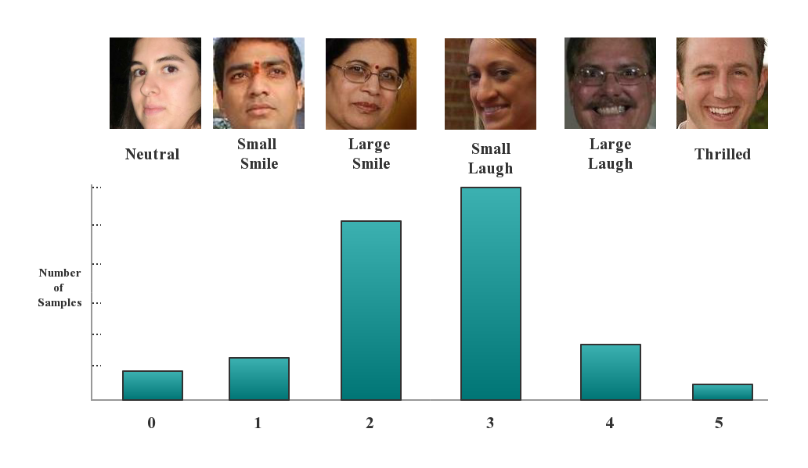
<h4 align="center"> Figure 2.2 Samples in HAPPEI database.</h4>

	
## 3. Background Knowledge
### 3.1 Feed-forward Neural Network
It is necessary to describe the basic feed-forward neural network before investigating into the more complex convolutional neural network. A detailed discussion of feed-forward neural network could be found in [1].  Given a supervised learning scenario and a set of labeled data a neural network offers a way of representing a nonlinear function h_W (x) of input vector variable x.  The function h_W (x) is parameterized by a weights matrix W that can be tuned to fit our data. Figure x shows a simple neural network architecture which consists of two input units or neurons.

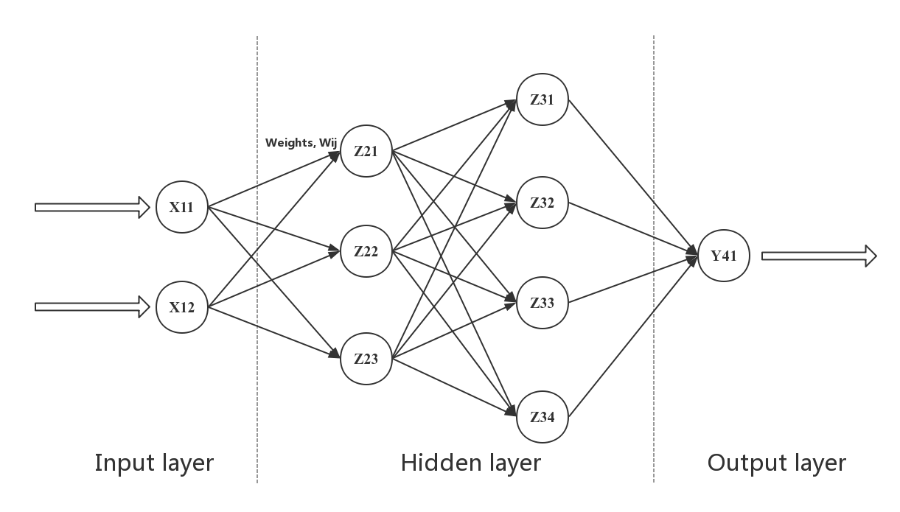
<h4 align="center"> Figure 3.1 Typical feed-forward neural network architecture.</h4>

### 3.2 Convolutional Neural Network
A convolutional neural network is a type of feed-forward neural network where the connectivity between neurons conforms to the organization of the animal visual cortex. There are three principal factors that distinguish the CNN from the simple feed-forward neural networks: local receptive fields, weight sharing, and spatial pooling or subsampling layers. Figure 3.2 shows a typical example of max pooling.

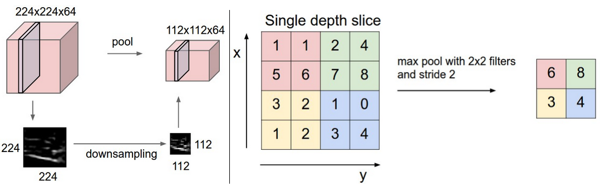
<h4 align="center"> Figure 3.2 Typical max pooling layer in CNN.</h4>

		
In a typical CNN, there are multiple layers, alternating between convolution and pooling. From an intuitive perspective, the low-level convolutional filters, such as those in the first convolutional layer, can be thought of low-level enco ding of the input data. In terms of the image as input, these low-level filters may consist of simple edge filters. As for those higher layers in the neural network, the CNN begins to learn more and more complicated structures. With multiple layers and a large number of filters, the CNN architecture is capable of extracting powerful representation of input data.

### 3.3 Recurrent Neural Network: Long-Short Term Memory
Long short-term memory (LSTM) is a special kind of RNN architecture proposed in 1997 [6]. LSTMs are explicitly designed to deal with the long-term dependency problem. All RNNS have the form of a chain of repeating modules of neural network. In standard RNNs, this repeating module has a very simple structure, such as a single tanh layer.

<h4 align="center"> Figure 3.3 The single-layer repeating module in a standard RNN.</h4>

### 3.4 Ensemble Learning
Ensemble learning methods are focused on obtaining better predictive performance by using multiple learning algorithms. Common types of ensembles include bootstrap aggregating (Bagging) [2], boosting [7], and stacking [17].

## 4. Our Approach and Methodology
### 4.1 Face Detection
We conduct face detection by ourselves using OpenCV’s Viola-Jones frontal face detector [16]. We set the minimum face size to 25 × 25 pixels, and use the Intraface library [18] to detect 49 facial points. We discard false positive faces based on the score of the alignment model provided by Intraface; any detection with a score lower than 0.3 is considered a non-face.

### 4.2 Residual Network (ResNet)
ResNet is a deep CNN architecture, proposed by [9]. In their design, the plain baselines (Figure 4.4, middle) are mainly based on the VGG nets [13] (Figure 4.1, left). The convolutional layers mostly have 3×3 filters and adhere to the two design rules: (i) layers have the same number of filters for the same output feature map size; and (ii) if the feature map size is halved, the number of filters is doubled so as to preserve the time complexity per layer. Downsampling is performed directly by convolutional layers that have a stride of 2. The network ends with a global average pooling layer and a 1000-way fully-connected softmax layer. The total number of weighted layers is 34 in Fig. 4.1 (middle).

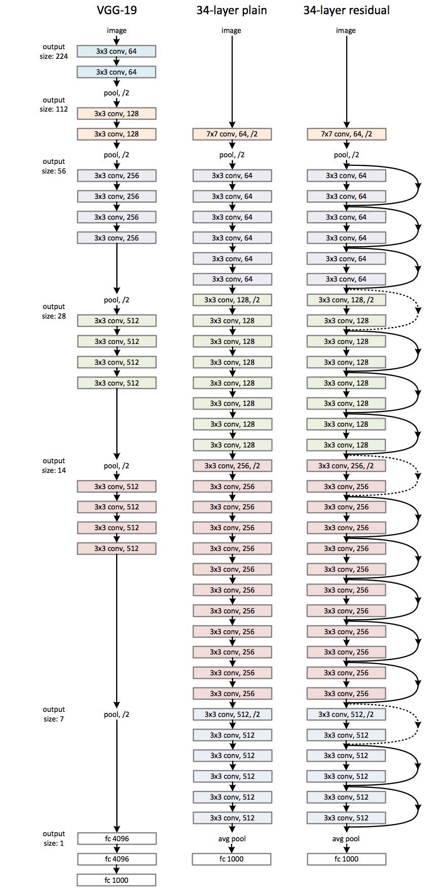
<h4 align="center"> Figure 4.1: Example network architectures of normal CNN and ResNet-34 for ImageNet: Left: the VGG-19 model \cite{simonyan2014very} (19.6 billion FLOPs) as a reference. Middle: a plain network with 34 parameter layers (3.6 billion FLOPs). Right: a residual network with 34 parameter layers (3.6 billion FLOPs). The dotted shortcuts increase dimensions.</h4>

### 4.3 Random Recurrent Deep Ensembles (RRDE)
Inspired by the work of [10], in our RRDE framework, we first train n CNNs for each image, then extract one vector representation from each network, and finally aggregate n feature vectors for each image into one compact feature vector using LSTM.

### 4.4 LSTM based Feature Aggregation
One straightforward way to aggregate the features is mean encoding. However, due to the diversity of these CNNs, for the same image, the difference between features extracted by different network can be huge. Extreme values have large impact on the final result. Therefore, mean encoding is not an ideal method for aggregation in this case. Inspired by the success of LSTM in sequencing learning [12], it is believed that LSTM can be used for aggregating these features. A cell memory C is used to memorize good feature representation of face feature vectors when scanning the sequence of feature vectors. The forget gate will decide how much of the content in the cell memory should be forgotten and the input gate in LSTM is employed to determine how much the new feature should be fed into the cell memory. The output gate decides how the features in the cell memory are converted to output features. The pipeline for LSTM based feature aggregation is shown in Figure 4.2.

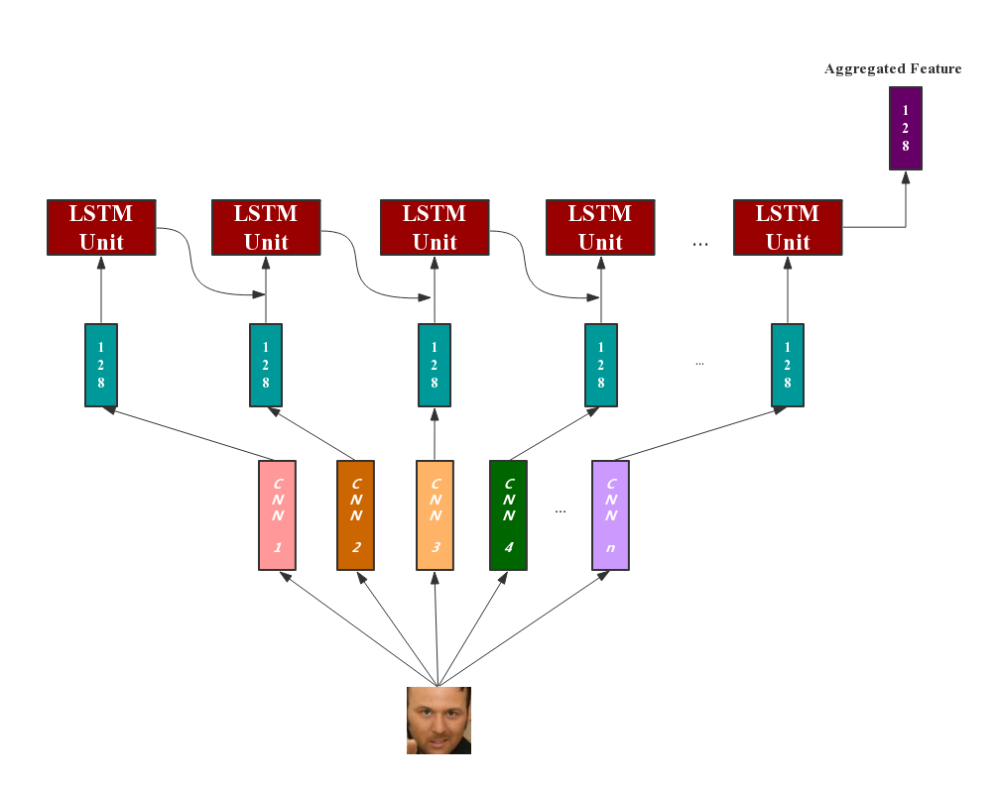
<h4 align="center"> Figure 4.2: LSTM based feature aggregation pipeline. </h4>

### 4.5 Group Emotion Model (GEM)
After obtaining aggregated feature representation of each individual face in an image, we now combine them in order to get an estimation of the overall happiness of the group in image. In this subsection we discuss our GEMs for group-level estimation before feeding into the final regressor:

* ___Mean of Face-level Estimations___: One naive way for overall group-level happiness estimation is to use the mean of all face-level estimations in the group as introduced by [4].
* ___Mean Encoding___: Another straight forward feature aggregation is mean encoding. We use the average of the face features as the feature representation of the whole image.
* ___Context-based Weighted GEM___: In above two GEMs, both local information, such as the level of occlusion of a face, and global information, such as the relative position of people in the image, are ignored. In this case, the effectiveness is compromised because all detected faces are assumed to contribute equally to the group-level estimation, which has been shown not generally the case [4]. In the context-based weighted GEM, social context features are incorporated when estimating the group happiness intensity by normalizing the occlusion level of a face by the sum of its Eu- clidean distance from all other faces. In this case, small faces which are located away from the group are penalized, while larger faces which are closer to all others are assigned a higher significance. If n = 1, then significance is set to 1. In the experiment, this context-based weight scheme is further cooperated together with mean of face-level estimation and mean encoding GEM.

## 5. Experiments
The whole pipeline framework of our RRDE based system is shown in Figure 5.1. There are four main stages including feature extraction, feature aggregation, using GEMs to leverage individual-level features, and finally performing regression to make estimations.

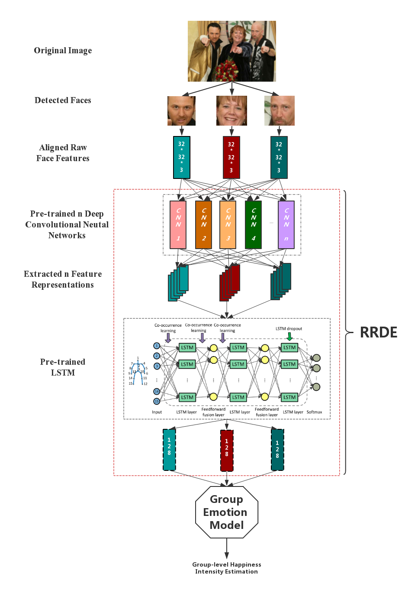
<h4 align="center"> Figure 5.1: The whole framework of proposed RRDE system. </h4>

The experiment environment is set in Python 2.7.10 with a number of toolkits includ- ing Theano(0.8.2), Scikit-learn(0.18.1), Numpy(1.12.0), Tensorflow(1.0.1) and etc. The training process is accelerated using GPUs.

### 5.1 Facial Feature Extraction
Since HAPPEI database is of relative small size, using deeper network like ResNet-50 or ResNet-101 will result in overfitting easily. After experiments, a 20-layer ResNet is finally trained, which has the same structure as the one trained by [5] on Cifar-10 database. Cifar-10 database consists of 60000 images and 10 classes [8].

Particularly, the basic residual architecture follows the form in Figure 4.1 (right), but we adopt a simpler version called ResNet-20. The network inputs to our 20-layer ResNet are 32 × 32 × 32 images, with every pixel value scaled to [−1, 1]. Then we use a stack of 6n (n equal to 3 in our RresNet-20) layers with 3 × 3 convolutions on the feature maps of sizes 32, 16, 8 respectively. As a result, there are 2n layers for each feature map size. The numbers of filters are 16,32,64 respectively. Convolutions with a stride of 2 are used to conduct subsampling. Finally, the network ends with a global average pooling, a 10-way fully-connected layer, and softmax. There are in total 6n + 2 (equal to 20) stacked weighted layers. Table 4.2 summarizes the architecture, and Figure 4.2 shows the architecture of ResNet-20.

Shortcut connections are connected to the pairs of 3 × 3 layers (totally 3n shortcuts). For each face image, it is forwarded through the whole network. The activations from the penultimate layer is extracted as face image representation. The dimension of the extracted face feature is 64.

When training the network, a weight decay of 0.00001 is used. The initial learning rate is 0.01 and the batch size is 32. The network is trained for 20000 iterations in total and for every 5000 iterations, learning rate is multiplied by 0.1. Measuring happiness is a regression problem, so it is supposed to use Squared Hinge Loss (L2-loss) in this problem, but since the interests are only in the feature extracted by CNN, cross entropy loss can also be used. In the experiment, the feature extracted by the network with cross entropy loss are found to be better than L2-loss. Therefore cross entropy loss is used with 6 classes as the final loss layer. Bilinear interpolation is used to resize these images and randomly adjust the brightness, contrast, saturation when training so the data set is augmented to train a more robust network. In total, there are n networks and n feature representations for each image.

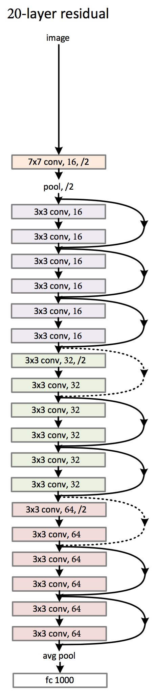
<h4 align="center"> Figure 5.2: ResNet-20 architecture. </h4>

### 5.2 Facial Feature Aggregation
LSTM is used to scan features extracted by ResNet-20. Two cells are stacked into the LSTM unit, and the memory size for each cell is 128. The order of scanning these features is the same so that LSTM can remember which network extracts better feature for a specific image. For every face image in the whole database, it is fed to n networks and get n 64-dimensional feature vectors. Then LSTM scans these vectors and L2-loss is used as loss function when training. Finally, a 128-dimensional vector is extracted from the final LSTM output for the final group happiness intensity analysis.
In order to prove the effectiveness of the proposed RRDE method, a single ResNet-20 is trained using all training data of HAPPEI with the L2-loss as loss function, to compare with a RRDE. All the parameters of this single ResNet are the same as ResNets in the ensemble except for the iteration changed from 20000 to 30000. The result is shown in Figure 4.4. This single ResNet is named as ResNet-20-All because it will be used again in the group-level happiness estimation comparison.

### 5.3 Group Emotion Modeling
After getting one efficient feature representation for each face image, the effectiveness of four GEMs mentioned in Chapter 3 is tested. As shown in Figure 5.3, for each of four GEMs, including normal mean-encoding, normal mean of face-level estimations, context-based weighted mean-encoding and mean of face-level estimations, the model with different features extracted from ensembles of different size is tested.

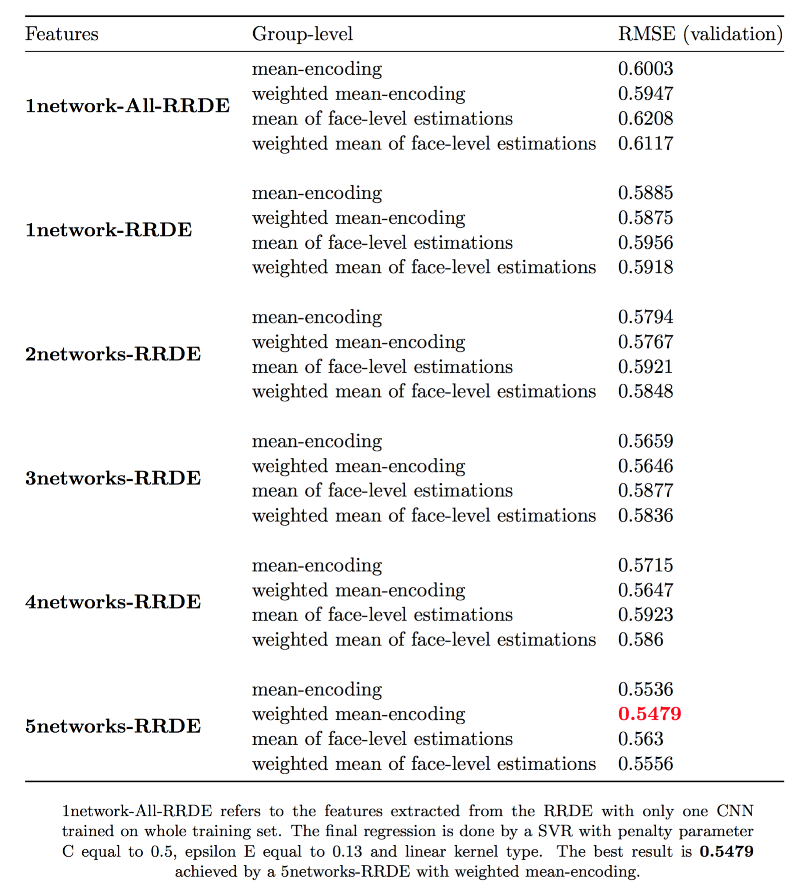
<h4 align="center"> Figure 5.3: Results of GEMs on the validation set. </h4>

### 5.4 Regression
The grid search combined with cross-validation is used to find the optimal parameters of each regressor. As shown in the Figure 5.4 and Figure 5.5 below, the optimal regressor is a SVR with penalty parameter C equal to 0.5, epsilon E equal to 0.13 and kernel type chosen as linear. For SVR, the penalty parameter C is ranged from 0.5 to 1.5, epsilon E is ranged from 0.05 to 0.15 and kernel function is chosen from linear, poly, rbf and sigmoid. In terms of Logistic Regression, the penalty parameter C is ranged from 0.5 to 1.5, the solver function is chosen from newton-cg, lbfgs, liblinear and sag.

<h4 align="center"> Figure 5.4: Confusion matrices of regressors. </h4>

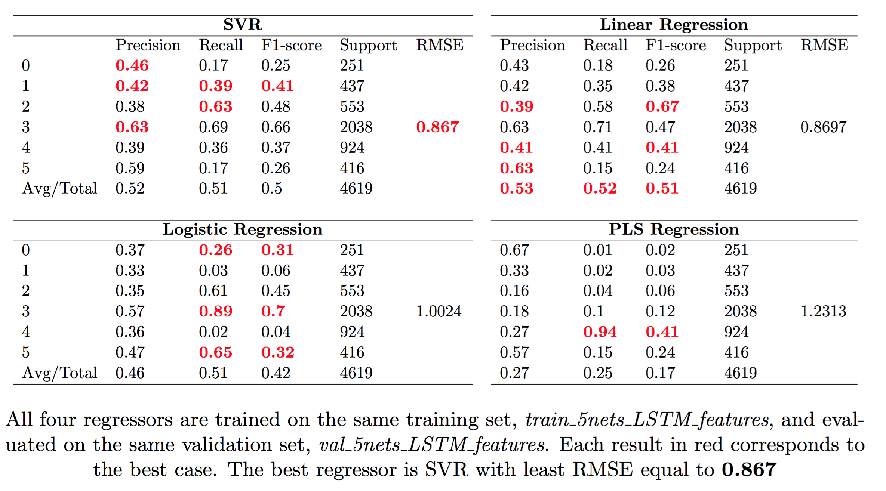
<h4 align="center"> Figure 5.5: Comparison of regressors. </h4>

I present some example outputs of our RRDE based GEA system. The group image in the example is taken from the validation set of HAPPEI database. The group in the image consists both females and males, the young and the old, the long hair and short hair, the one with glasses and the one without glasses, as shown in Figure 5.6. The result from Figure 5.7 shows that our system generalizes well on diverse images.

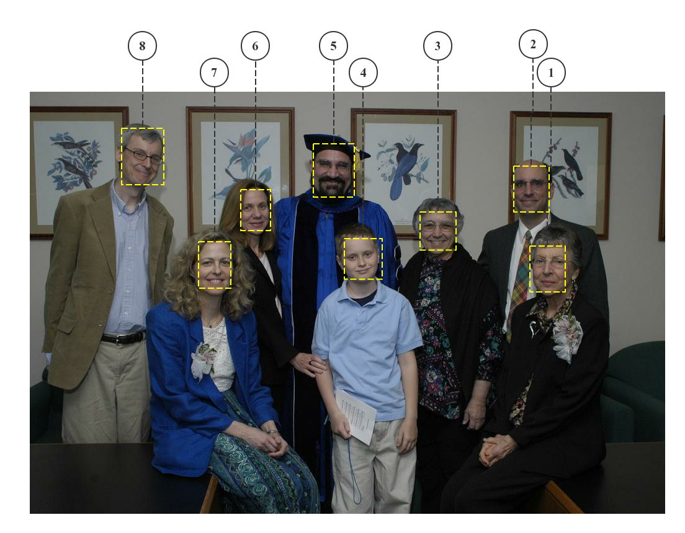
<h4 align="center"> Figure 5.6: An example of emotion analysis on HAPPEI database. </h4>

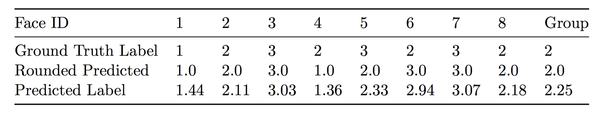
<h4 align="center"> Figure 5.7: Result for the example. </h4>

## 6 Application
For demonstration and future research purpose, a set of RESTful APIs and an interactive web application are set. The backend is built using Flask in Python.

**Source Code:** [GRoup Emotion Parser (GREP)](https://github.com/PAN001/GREP/tree/restful_api)

**Demo:** [grep.net.cn](https://grep.net.cn)

## 7 About the Author

**Yichen PAN** is an undergraduate student at University of Nottingham Ningbo China, and master candidate at Carnegie Mellon University. He has been devoted to being computer scientist since the university. Constantly involved in interdisciplinary research in computer science. Interested in programable data collection, process and analysis, machine learning, NLP and deep learning. Experienced in application development.

[LinkedIn](https://www.linkedin.com/in/yichenpan/) 

[Website](http://panatopos.com)

## 8 References

[1] Bishop, C. M. Pattern recognition. Machine Learning 128 (2006), 1–58.

[2] Breiman, L. Bagging predictors. Machine learning 24, 2 (1996), 123–140.

[3] Dhall, A., Asthana, A., and Goecke, R. Facial expression based automatic album creation. In International Conference on Neural Information Processing (2010), Springer, pp. 485–492.

[4] Dhall, A., Goecke, R., and Gedeon, T. Automatic group happiness intensity analysis. IEEE Transactions on Affective Computing 6, 1 (2015), 13–26.

[5] He, K., Zhang, X., Ren, S., and Sun, J. Deep residual learning for image recog- nition. In Proceedings of the IEEE Conference on Computer Vision and Pattern Recognition (2016), pp. 770–778.

[6] Hochreiter, S., and Schmidhuber, J. Long short-term memory. Neural com- putation 9, 8 (1997), 1735–1780.

[7] Kearns, M., and Valiant, L. Cryptographic limitations on learning boolean formulae and finite automata. Journal of the ACM (JACM) 41, 1 (1994), 67–95.

[8] Krizhevsky, A., and Hinton, G. Learning multiple layers of features from tiny images.

[9] Krizhevsky, A., Sutskever, I., and Hinton, G. E. Imagenet classification with deep convolutional neural networks. In Advances in neural information pro- cessing systems (2012), pp. 1097–1105.

[10] Lee, S., Prakash, S. P. S., Cogswell, M., Ranjan, V., Crandall, D., and Batra, D. Stochastic multiple choice learning for training diverse deep ensembles. In Advances in Neural Information Processing Systems (2016), pp. 2119–2127.

[11] Russell, B. C., Torralba, A., Murphy, K. P., and Freeman, W. T. La- belme: a database and web-based tool for image annotation. International journal of computer vision 77, 1 (2008), 157–173.

[12] Sak, H., Senior, A. W., and Beaufays, F. Long short-term memory recurrent neural network architectures for large scale acoustic modeling. In Interspeech (2014), pp. 338–342.

[13] Simonyan, K., and Zisserman, A. Very deep convolutional networks for large- scale image recognition. arXiv preprint arXiv:1409.1556 (2014).

[14] Szegedy, C., Liu, W., Jia, Y., Sermanet, P., Reed, S., Anguelov, D., Erhan, D., Vanhoucke, V., and Rabinovich, A. Going deeper with convo- lutions. In Proceedings of the IEEE Conference on Computer Vision and Pattern Recognition (2015), pp. 1–9.

[15] Vandal, T., McDuff, D., and El Kaliouby, R. Event detection: Ultra large- scale clustering of facial expressions. In Automatic Face and Gesture Recognition (FG), 2015 11th IEEE International Conference and Workshops on (2015), vol. 1, IEEE, pp. 1–8.

[16] Viola, P., and Jones, M. J. Robust real-time face detection. International journal of computer vision 57, 2 (2004), 137–154.

[17] Wolpert, D. H. Stacked generalization. Neural networks 5, 2 (1992), 241–259.

[18] Xiong, X., and De la Torre, F. Supervised descent method and its applications to face alignment. In Proceedings of the IEEE conference on computer vision and pattern recognition (2013), pp. 532–539.

[19] Zhu, X., and Ramanan, D. Face detection, pose estimation, and landmark localization in the wild. In Computer Vision and Pattern Recognition (CVPR), 2012 IEEE Conference on (2012), IEEE, pp. 2879–2886.
